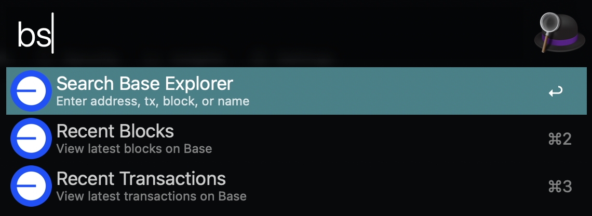

# Alfred BaseScan

Quick Base blockchain explorer lookup for Alfred.



## Features

- Search Base & Base Sepolia BaseScan explorers
- Lookup transactions, addresses, blocks, and Basenames

## Installation

1. Download latest `BaseScan.alfredworkflow` from [Releases](../../releases)
2. Double click to install in Alfred

## Usage

- `bs <query>` - Search Base mainnet
- `bss <query>` - Search Base Sepolia

### Examples

| Command            | Description           |
| ------------------ | --------------------- |
| `bs 0x123...`      | View transaction      |
| `bs 0xabc...`      | View address          |
| `bs 123456`        | View block            |
| `bs name.base.eth` | Look up name          |
| `bs name`          | Look up name.base.eth |

## Development

1. Clone repo
2. Link workflow directory to Alfred:
   ```bash
   ln -s "$(pwd)/workflow" "$HOME/Library/Application Support/Alfred/Alfred.alfredpreferences/workflows/basescan"
   ```
3. To build: `cd workflow && zip -r ../BaseScan.alfredworkflow . -x ".*" -x "__MACOSX"`

## Credits

Thanks to [Matt Solomon's original Alfred Etherscan Search](https://github.com/mds1/alfred-etherscan-search) for the inspiration!
